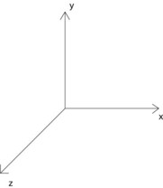
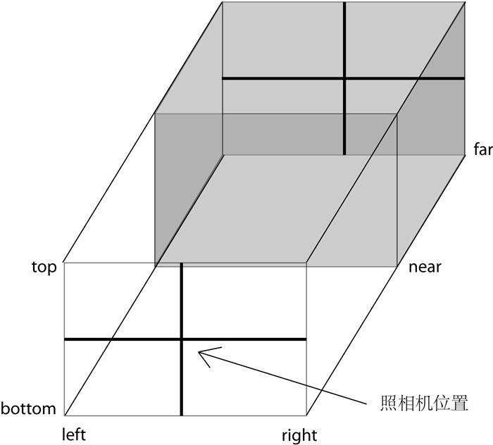

[webglbook](https://github.com/tparisi/webglbook)
[three.js](https://github.com/mrdoob/three.js)
[openclipart](http://www.openclipart.org/)
[godotengine](https://godotengine.org/)
[voxel-engine](https://github.com/maxogden/voxel-engine)

[Three.js入门指南：张雯莉](https://read.douban.com/reader/ebook/7412854/)
```
摘自：《Three.js入门指南》 — 张雯莉
在豆瓣阅读书店查看：https://read.douban.com/ebook/7412854/
本作品由图灵社区授权豆瓣阅读全球范围内电子版制作与发行。
© 版权所有，侵权必究。
```


>[source-han-serif](https://github.com/adobe-fonts/source-han-serif/tree/release/)
>[facetype字体转换](https://gero3.github.io/facetype.js/)
OpenGL ES Embedded Systems
WebGL无缝整合到页面，本身只是一个元素

3D坐标系
x、y、z

Mesh网格
一个或多个多边形组成的物体

3D网格叫做model模型

材质 material
纹理 texture
光源 light

变换和矩阵
transform 

shader
longitude 经度
latitude 纬度

vertex shader 顶点着色器
fragment shader 片元着色器
pixel shader 像素着色器

geometry 几何
Material 材质

- Renderer:action 咔嚓
- Scene:舞台
- Camera：镜头

立方体、平面、球体、圆柱体、四面体、八面体等几何形状



```js
Cameras（照相机，控制投影方式）
    Camera
    OrthographicCamera（正交:平行，比例不变）
    THREE.OrthographicCamera(left, right, top, bottom, near, far)
```



```js
    PerspectiveCamera（透视:：人眼近大远小）
    THREE.PerspectiveCamera(fov, aspect, near, far)

Core（核心对象）

    BufferGeometry
    Clock（用来记录时间）
    EventDispatcher
    Face3
    Face4
    Geometry
    Object3D
    Projector
    Raycaster（计算鼠标拾取物体时很有用的对象）

Lights（光照）
    Light
    AmbientLight
    AreaLight
    DirectionalLight
    HemisphereLight
    PointLight
    SpotLight

Loaders（加载器，用来加载特定文件）
    Loader
    BinaryLoader
    GeometryLoader
    ImageLoader
    JSONLoader
    LoadingMonitor
    SceneLoader
    TextureLoader

Materials（材质，控制物体的颜色、纹理等）
    Material
    LineBasicMaterial
    LineDashedMaterial
    MeshBasicMaterial
    MeshDepthMaterial
    MeshFaceMaterial
    MeshLambertMaterial:
    Idiffuse = Kd * Id * cos(theta)
    
    MeshNormalMaterial
    MeshPhongMaterial
    ParticleBasicMaterial
    ParticleCanvasMaterial
    ParticleDOMMaterial
    ShaderMaterial
    SpriteMaterial

Math（和数学相关的对象）
    Box2
    Box3
    Color
    Frustum
    Math
    Matrix3
    Matrix4
    Plane
    Quaternion
    Ray
    Sphere
    Spline
    Triangle
    Vector2
    Vector3
    Vector4

Objects（物体）
    Bone（骨骼）
    Line（线）
    LOD
    Mesh（网格，最常用的物体）
    Mesh(geometry, material)

    MorphAnimMesh
    Particle
    ParticleSystem
    Ribbon
    SkinnedMesh
    Sprite

Renderers（渲染器，可以渲染到不同对象上）
    CanvasRenderer
    WebGLRenderer（使用WebGL渲染，这是本书中最常用的方式）
    WebGLRenderTarget
    WebGLRenderTargetCube
    WebGLShaders（着色器，在最后一章作介绍）

Renderers / Renderables
    RenderableFace3
    RenderableFace4
    RenderableLine
    RenderableObject
    RenderableParticle
    RenderableVertex

Scenes（场景）
    Fog
    FogExp2
    Scene

Textures（纹理）
    CompressedTexture
    DataTexture
    Texture

Extras
    FontUtils
    GeometryUtils
    ImageUtils
    SceneUtils

Extras / Animation
    Animation
    AnimationHandler
    AnimationMorphTarget
    KeyFrameAnimation

Extras / Cameras
    CombinedCamera
    CubeCamera

Extras / Core
    Curve
    CurvePath
    Gyroscope
    Path
    Shape

Extras / Geometries（几何形状）
// 水平分段：分段是什么意思？切片，切片越多，控制可以越精细

    CircleGeometry:圆 THREE.CircleGeometry(radius, segments, thetaStart, thetaLength)
    ConvexGeometry
    CubeGeometry：长方体 THREE.CubeGeometry(width, height, depth, widthSegments, heightSegments, depthSegments)
    CylinderGeometry：圆柱 THREE.CylinderGeometry(radiusTop, radiusBottom, height, radiusSegments, heightSegments, openEnded)
    ExtrudeGeometry
    IcosahedronGeometry：正二十面体
    LatheGeometry
    OctahedronGeometry:正八面体
    ParametricGeometry
    PlaneGeometry:平面THREE.PlaneGeometry(width, height, widthSegments, heightSegments)
    PolyhedronGeometry
    ShapeGeometry：
    SphereGeometry： 球体 /* 半径 */ THREE.SphereGeometry(radius, segmentsWidth, segmentsHeight, phiStart, phiLength, thetaStart, thetaLength)
    TetrahedronGeometry
    TextGeometry:文字形状THREE.TextGeometry(text, parameters)
    {
        size:"字号大小，一般为大写字母的高度",
        height:"文字的厚度",
        curveSegments:"弧线分段数，使得文字的曲线更加光滑",
        font:"字体，默认是'helvetiker'，需对应引用的字体文件",
        weight:"值为'normal'或'bold'，表示是否加粗",
        style:"值为'normal'或'italics'，表示是否斜体",
        bevelEnabled:"布尔值，是否使用倒角，意为在边缘处斜切",
        bevelThickness:"倒角厚度",
        bevelSize:"倒角宽度"
    }
    TorusGeometry:圆环面 THREE.TorusGeometry(radius, tube, radialSegments, tubularSegments, arc)
    TorusKnotGeometry:圆环结 THREE.TorusKnotGeometry(radius, tube, radialSegments, tubularSegments, p, q, heightScale)
    TubeGeometry

Extras / Helpers
    ArrowHelper
    AxisHelper
    CameraHelper
    DirectionalLightHelper
    HemisphereLightHelper
    PointLightHelper
    SpotLightHelper

Extras / Objects
    ImmediateRenderObject
    LensFlare
    MorphBlendMesh

Extras / Renderers / Plugins
    DepthPassPlugin
    LensFlarePlugin
    ShadowMapPlugin
    SpritePlugin

Extras / Shaders
    ShaderFlares
    ShaderSprite
```

照相机、几何形状、材质、物体

使用动画、模型导入、加入光照

着色器

## 照相机

三维投影到二维的一个抽象